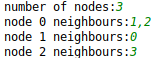
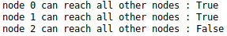

# Build project
## Python version
This script uses python 3.7, please make sure that you use python 3 to run it.

It is good practice to run pythoin scripts in virtual environment, but this one does not have any dependency, therefore it is not needed.

# User Input
After starting application, the user is prompted to enter number of nodes in graph
afterwards it asks to define edges of every node, please separate neighbour nodes by ','.
the nodes are numbered on range **[0,N-1]** where N is amount of nodes passed as on first prompt.

See example below:

#Output

This example will generate following output:

As one can seem the nodes 0 and 1 can reach all other nodes of the graph, but node 2 can not.