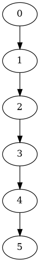

# Build project
## Python version
This script uses python 3.7, please make sure that you use python 3 to run it.

It is good practice to run python scripts in virtual environment, but this one does not have any dependency, therefore it is not needed.

# User Input

There is no user input, the only way to modify data structure is to modify it in code.

```python
graph = {
        0:[1],
        1:[2],
        2:[3],
        3:[4],
        4:[5],
        5:[]
  
    }
```

The key in this struct is a node ID, and list associated with that key is the list of nodes that are connected to this node.
Example above can be shown in graph like this:




# Output

information of a dependency cycle will be printed to standard output.

# Application in Zip
[Download zip file](https://github.com/robgal519/DistributedSystem/releases/download/v0.5/lab5.zip)